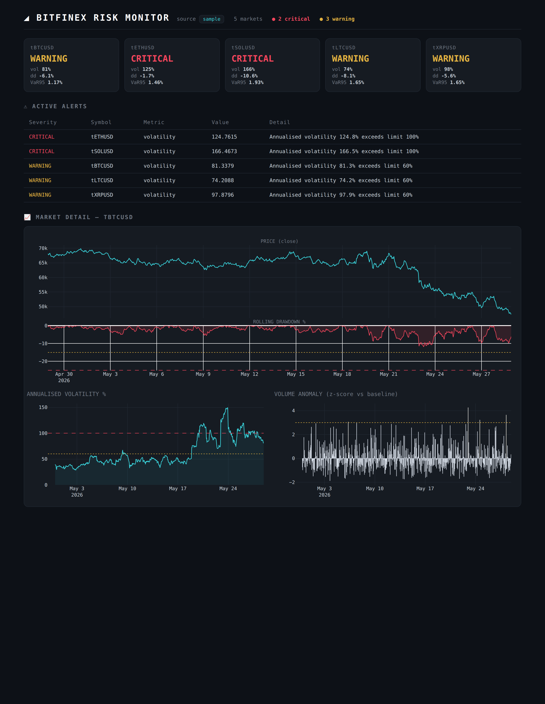

# Bitfinex Risk Monitor

A real-time market risk monitoring dashboard for crypto trading pairs, built on the
**Bitfinex public API**. It tracks live and historical risk metrics across a basket
of markets, flags limit breaches by severity, and surfaces anomalies for
investigation — the same monitor → detect → escalate loop a trading-risk desk runs
every day.



---

## What it does

- **Pulls market data** (OHLCV candles + live ticker) from Bitfinex's public REST v2
  API — no account or API key required for market data.
- **Computes risk metrics** per market: annualised rolling volatility, per-bar
  returns, rolling max drawdown, a volume-anomaly z-score, and 95% Historical
  Value-at-Risk / Expected Shortfall.
- **Monitors limits**: every metric is checked against configurable warning/critical
  thresholds defined in one place (`config.py`), mirroring how a desk maintains and
  reviews trading limits.
- **Generates an alert log**: each breach becomes a structured, severity-ranked
  record (`CRITICAL` / `WARNING`) ready to escalate.
- **Visualises everything** in a dark "risk terminal" dashboard: status tiles per
  market, an active-alerts table, and price/drawdown, volatility, and volume-anomaly
  charts.

## Why these metrics

| Metric | What it catches |
|---|---|
| Annualised volatility | Markets entering a high-risk regime |
| Single-bar return | Sudden price shocks / fat-tail moves |
| Rolling drawdown | Sustained adverse moves from a recent peak |
| Volume z-score | Abnormal activity vs the market's own baseline |
| Bid-ask spread | Thin liquidity / stressed order books |
| VaR & Expected Shortfall | Expected loss size at a given confidence level |

## Architecture

```
config.py                # markets, timeframe, thresholds, limits (single source of truth)
generate_sample_data.py  # synthetic OHLCV w/ injected stress events (offline demo)
app.py                   # Streamlit dashboard (live entry point)
build_preview.py         # renders a self-contained static HTML snapshot
src/
  data_fetcher.py        # Bitfinex REST v2 client + automatic sample fallback
  risk_engine.py         # pure metric functions (volatility, drawdown, VaR, ...)
  alerts.py              # threshold checks -> severity-ranked Alert records
  charts.py              # Plotly figure builders, shared by app + preview
```

The risk engine is a set of **pure functions** (DataFrame in, DataFrame out), so the
analytics are easy to test and reason about independently of the data source or UI.

## Running it

```bash
pip install -r requirements.txt

# Optional: generate offline sample data (lets everything run with no network)
python generate_sample_data.py

# Live dashboard (pulls real Bitfinex data; falls back to sample data if offline)
streamlit run app.py

# Or render a static HTML snapshot to reports/dashboard_preview.html
python build_preview.py
```

### Offline / resilient by design
If the Bitfinex API is unreachable (no network, rate limit, firewall), the data
layer automatically falls back to bundled sample data and tags the dashboard source
as `sample`, so the tool always renders. On a connected machine it pulls live data
and tags the source as `live`.

## Configuration

All monitored markets and risk limits live in `config.py`. Add a pair to `SYMBOLS`,
change the candle `TIMEFRAME`, or tune any threshold — no other code changes needed.

## Tech stack
Python · pandas · NumPy · Plotly · Streamlit · Bitfinex REST v2 API

## Notes & next steps
- Add WebSocket streaming for true tick-level monitoring (Bitfinex `wss://` public
  channels).
- Persist the alert log and add an email/Telegram escalation hook.
- Add unit tests for the risk engine (the pure-function design makes this simple).

---
*Built as a portfolio project. Market data © Bitfinex; sample data is synthetic.*
